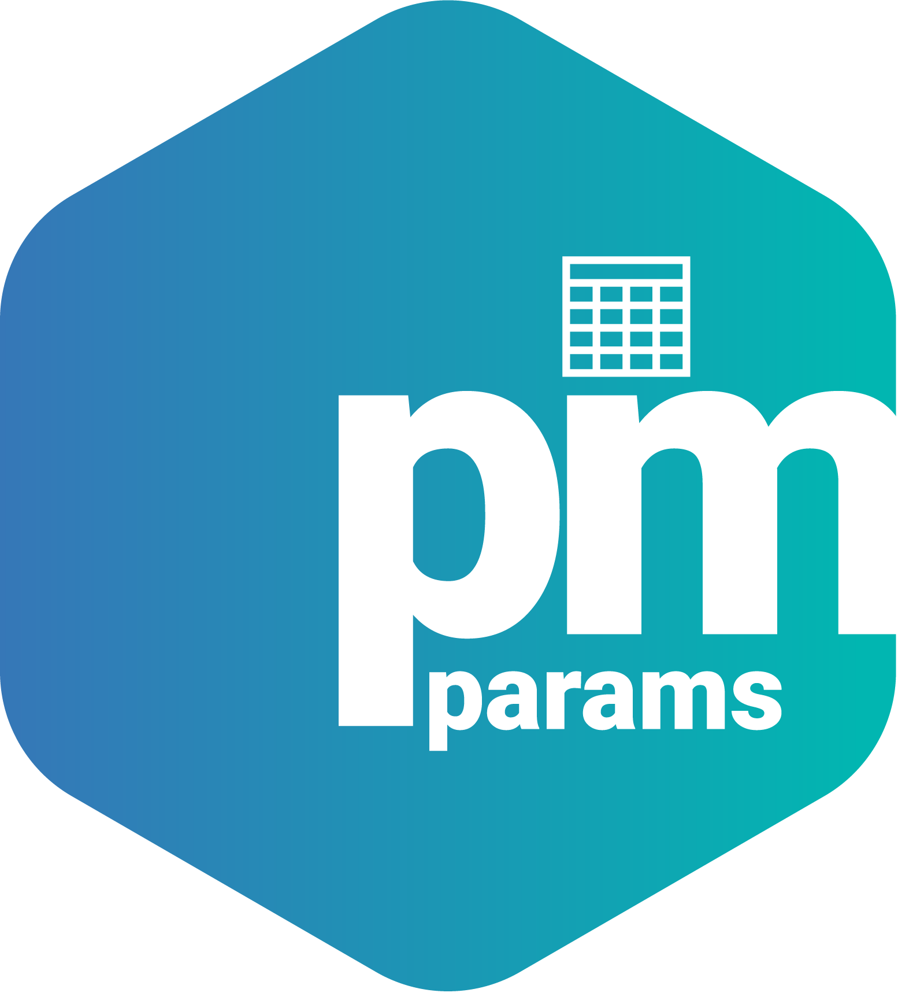

<!-- README.md is generated from README.Rmd. Please edit that file -->

# pmparams 

<!-- badges: start -->

<!-- badges: end -->

## Overview

`pmparams` helps define and format parameter tables. Example code
demonstrating the package as part of an analysis workflow is available
in our [MeRGE Expo 1
repository](https://github.com/metrumresearchgroup/expo1-nonmem-foce/).

### Featured Vignettes

-   [Getting
    Started](https://metrumresearchgroup.github.io/pmparams/articles/getting-started.html)
    – Introduction to `pmparams` functions.
-   [Making Bootstrap
    Tables](https://metrumresearchgroup.github.io/pmparams/articles/making-bootstrap-parameter-tables.html)
    – Introduction to `pmparams` functions that create bootstrap
    parameter tables.

## Documentation

Public documentation of all functions is hosted at
<https://metrumresearchgroup.github.io/pmparams/reference/index.html>

## Development

`pmparams` uses [pkgr](https://github.com/metrumresearchgroup/pkgr) to
manage development dependencies and
[renv](https://rstudio.github.io/renv/) to provide isolation. To
replicate this environment,

1.  clone the repo

2.  install pkgr

3.  open package in an R session and run `renv::init(bare = TRUE)`

    -   install `renv` \> 0.8.3-4 into default `.libPaths()` if not
        already installed

4.  run `pkgr install` in terminal within package directory

5.  restart session

Then, launch R with the repo as the working directory (open the project
in RStudio). renv will activate and find the project library.

## Getting help

If you encounter a clear bug, please file an issue with a minimal
reproducible example on
[pmparams](https://github.com/metrumresearchgroup/pmparams/issues).
